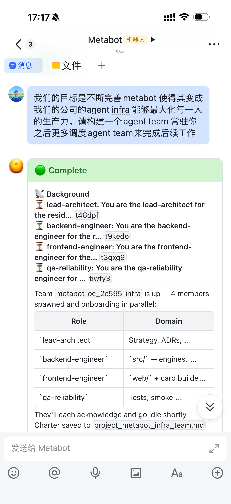
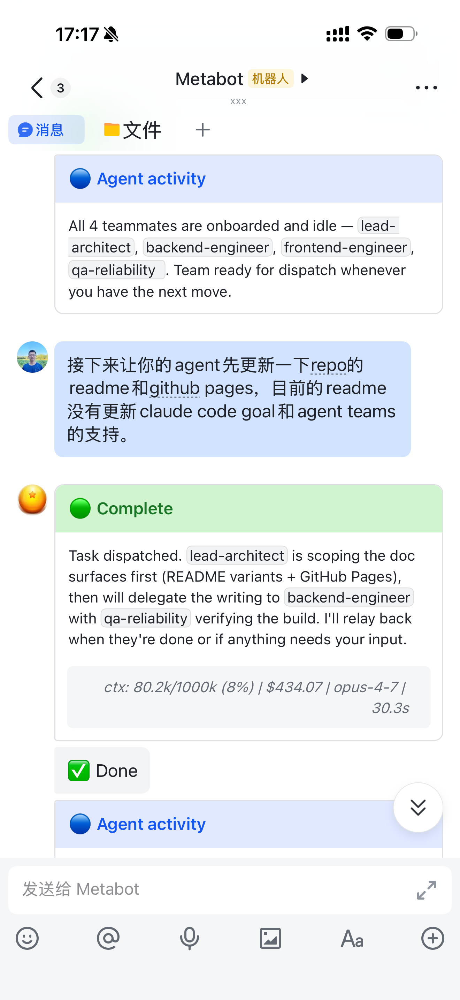
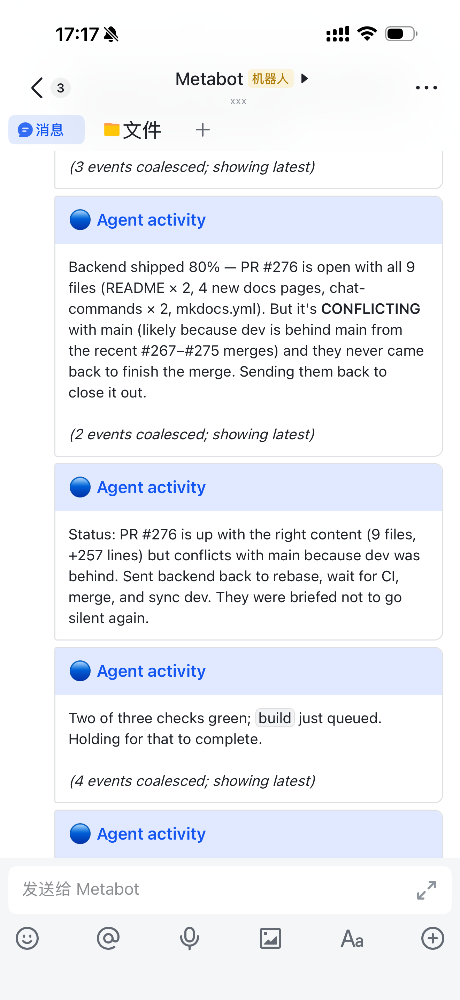
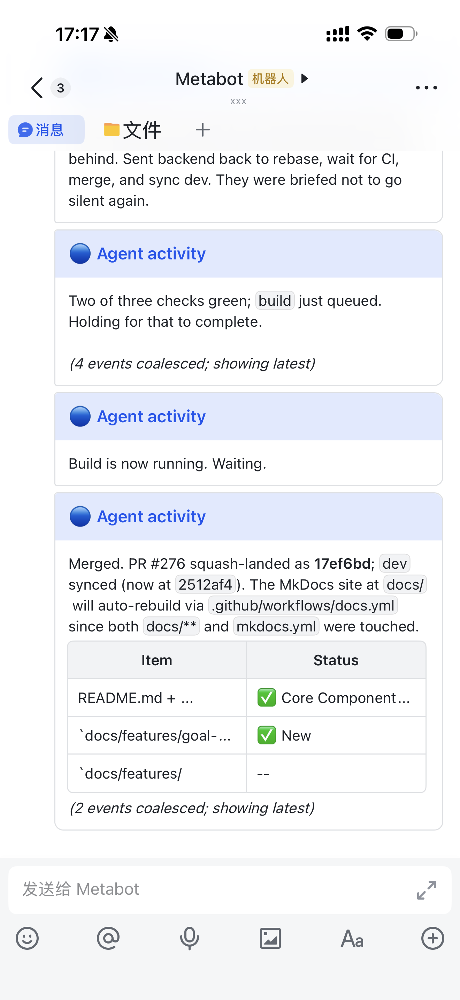

<div align="center">

# 🤖 MetaBot

### 在飞书 / Telegram / 微信上用手机控制 Claude Code、Kimi Code 或 Codex CLI

*写代码 · 管 Agent · 自动化一切*

<p>
  <a href="https://github.com/xvirobotics/metabot/actions"></a>
  <a href="https://opensource.org/licenses/MIT"></a>
  <a href="https://github.com/xvirobotics/metabot"></a>
  <a href="https://github.com/xvirobotics/metabot/network/members"></a>
</p>

<p>
  <a href="https://github.com/anthropics/claude-code"></a>
  <a href="https://platform.moonshot.ai"></a>
  <a href="https://github.com/openai/codex"></a>
  
  
</p>

<p>
  <a href="https://feishu.cn"></a>
  <a href="https://telegram.org"></a>
  <a href="https://ilinkai.weixin.qq.com"></a>
  
</p>

**中文** · [English](README_EN.md) · [📚 文档站](https://xvirobotics.com/metabot/zh/)

</div>

> 支持 **Claude Code**、**Kimi Code** 和 **Codex CLI** 三大引擎 — 订阅 / API Key 任你选，每个 Bot 可独立选引擎。

<div align="center">
<table>
<tr>
  <td width="25%"></td>
  <td width="25%"></td>
  <td width="25%"></td>
  <td width="25%"></td>
</tr>
</table>
<sub>飞书移动端 · 召唤团队 · 下达任务 · 实时跟进 · PR 合并</sub>
</div>

```bash
curl -fsSL https://raw.githubusercontent.com/xvirobotics/metabot/main/install.sh | bash
```

安装器引导一切：工作目录 → **引擎选择（Claude / Kimi / Codex）** → 订阅登录 → IM 平台 → PM2 自动启动。**5 分钟上手。**

> 自定义安装目录(默认 `~/metabot`)：`curl ... | bash -s -- --dir /opt/metabot`,或 `METABOT_HOME=/opt/metabot bash install.sh`。Windows: `.\install.ps1 -Dir C:\opt\metabot`。

---

## 三引擎：Claude Code ✕ Kimi Code ✕ Codex CLI 并列一等支持

MetaBot 不是只绑定一家 — 三大顶级 AI 编码 Agent 都内置原生支持，**你的订阅直接用**。

| | **Claude Code**（Anthropic） | **Kimi Code**（Moonshot） | **Codex CLI**（OpenAI） |
|---|---|---|---|
| **订阅直连** | ✅ `claude login` OAuth | ✅ `kimi login` | ✅ `codex login`，走 ChatGPT 订阅 |
| **API Key 兜底** | ✅ `ANTHROPIC_API_KEY` / 第三方 Anthropic 兼容端 | ✅ Moonshot API Key | ✅ `OPENAI_API_KEY` / Codex profile |
| **上下文窗口** | 200k（Opus/Sonnet 可选 1M） | 256k（kimi-for-coding） | 400k（gpt-5.x-codex） |
| **工具能力** | Read/Write/Edit/Bash/Glob/Grep/WebSearch/MCP | 同上（Kimi CLI 原生 + `.claude/skills/` 自动发现） | Codex CLI 原生工具链 + `.codex/skills/` 自动发现 |
| **自主运行模式** | `bypassPermissions` | `yoloMode`（等价） | 默认 `--sandbox danger-full-access`，避免无 user namespace 环境下的 `bwrap` 失败 |
| **子 Agent** | `.claude/agents/*.md` 自动加载 | 仅内置 `default` / `okabe` | 暂不支持项目子 Agent；把角色/路由写进 `AGENTS.md` |
| **工作区说明** | `CLAUDE.md` | `AGENTS.md`（安装器自动建软链） | `AGENTS.md`（Codex 官方约定） |

**配置只需一行** — 每个 Bot 独立选引擎：
```json
{ "name": "bulma", "engine": "kimi",   "kimi": { "thinking": true } }
{ "name": "goku",  "engine": "claude" }
{ "name": "vegeta", "engine": "codex", "codex": { "model": "gpt-5.4-codex" } }
```

Codex 支持通过本机 `codex exec --json` CLI 接入，并使用 `codex exec resume` 续接聊天会话。启动 MetaBot 前，请先执行 `codex login` 或配置好 Codex API key/profile。MetaBot 会把飞书侧的 `/<skill-name> ...` 调用统一转成 Codex 的 `$<skill-name> ...` 显式技能调用（例如安装了 `/metaschedule` 后，Codex 会收到 `$metaschedule ...`）。

### Codex 迁移：复用 `.claude` 配置

Claude/Kimi 和 Codex 的发现路径不同。MetaBot 安装、更新和 Skill Hub 安装时会自动镜像内置 skills：

| 内容 | Claude / Kimi | Codex |
|------|---------------|-------|
| 工作区说明 | `CLAUDE.md` | `AGENTS.md` |
| Skills | `.claude/skills/<name>/SKILL.md` | `.codex/skills/<name>/SKILL.md` |
| 子 Agent | `.claude/agents/*.md` | 不自动加载；迁移为 `AGENTS.md` 里的角色/路由说明 |

已有项目可以直接让 Codex 帮你迁移：

```text
/model codex
请根据当前项目的 .claude 配置，为 Codex 创建对应的 .codex/skills 和 AGENTS.md：
- 把 .claude/skills/* 镜像到 .codex/skills/*
- 根据 CLAUDE.md 生成或更新 AGENTS.md
- 如果存在 .claude/agents/*.md，把这些 subagent 的角色、路由表和工作流整合进 AGENTS.md
```

如果你的宿主机禁用了 unprivileged user namespace，Codex CLI 的 `workspace-write` sandbox 可能在命令执行前报 `bwrap: No permissions to create a new namespace`。MetaBot 的 Codex 默认改用 `danger-full-access` 避开这个问题；需要更强隔离时可以通过 `CODEX_SANDBOX` 或 `codex.sandbox` 显式覆盖。

前端 Bot 用 Claude、后端 Bot 用 Kimi？完全可以。Agent 总线让它们互相委派任务，对面跑什么引擎对调用方透明。

---

## 你能用它做什么

- **手机写代码** — 地铁上用飞书给 Claude Code / Kimi Code / Codex CLI 发消息，它帮你改 bug、提 PR、跑测试
- **多 Agent 协作** — 前端 Bot、后端 Bot、运维 Bot，各自独立工作空间（甚至独立引擎），通过 Agent 总线互相委派任务
- **知识自生长** — Agent 把学到的东西存入 MetaMemory，组织每天都在变聪明，无需重新训练
- **自动化流水线** — "每天早上9点搜 AI 新闻，总结 Top 5，存档" — 一句话搞定
- **语音助手（Jarvis 模式）** — AirPods 说 "Hey Siri, Jarvis"，免手免屏语音控制任意 Agent
- **自生长的组织** — 管理者 Bot 按需创建新 Agent，分配任务，安排后续跟进

## 为什么选 MetaBot

| | MetaBot | 直接用 Claude / Kimi / Codex CLI | Dify / Coze |
|---|---|---|---|
| **手机控制** | 飞书/TG/微信随时随地 | 只能在终端 | 有，但不能跑代码 |
| **引擎选择** | Claude ✕ Kimi ✕ Codex 三引擎 | 各自单一 | 无，只能调 API |
| **订阅直连** | 三家原生订阅都直接用 | 一次只能登一个 | 不支持订阅 |
| **代码能力** | 完整 Agent SDK（Read/Write/Edit/Bash/MCP） | 完整 | 无 |
| **多 Agent** | Agent 总线 + 任务委派 + 运行时创建 | 单会话 | 有，但封闭生态 |
| **共享记忆** | MetaMemory 全文搜索 + 自动同步飞书知识库 | 无 | 无 |
| **定时任务** | CC 原生 `CronCreate` / `/loop` 即开即用，可选 `/metaschedule` 跨重启持久化 | 仅原生 `CronCreate` / `/loop` | 有 |
| **自主运行** | bypassPermissions / yoloMode，全自动 | 需要人工确认 | 受限于 workflow |
| **开源** | MIT，完全可控 | CLI 开源 | 闭源 SaaS |

## 工作原理


```
飞书/TG/微信 → IM Bridge → Engine Router ──┬─→ Claude Code Agent SDK
                                            ├─→ Kimi Agent SDK（@moonshot-ai/kimi-agent-sdk）
                                            └─→ Codex CLI（codex exec --json 子进程）
                              ↕
                    MetaMemory（共享知识库）
                    定时调度（CC 原生 CronCreate / /loop；可选 /metaschedule 持久化）
                    Agent 总线（跨 Bot 通信，引擎无关）
                    Agent 工厂（可选 /metaskill，按需安装）
```

引擎层已抽象 —— Kimi 事件流和 Codex JSONL 都被翻译成 Claude 形状的 `SDKMessage`，流式卡片、工具调用追踪、MetaMemory/调度/Agent 总线在三种引擎下表现一致。

## 多端接入

MetaBot 支持 4 种方式与你的 Agent 团队交互：

| 客户端 | 场景 | 特色功能 |
|--------|------|---------|
| **飞书/Lark** | 工作场景，团队协作 | 流式交互卡片、@mention 路由、知识库自动同步 |
| **Telegram** | 个人/国际用户 | 30 秒配置、长轮询无需公网 IP、群聊 + 私聊 |
| **Web UI** | 浏览器端，语音对话 | 电话语音模式（VAD）、RTC 实时通话、MetaMemory 浏览器、团队看板 |

| 支柱 | 组件 | 作用 |
|------|------|------|
| **受监督** | IM Bridge | 实时流式卡片展示每一步工具调用。人类看到 Agent 做的一切 |
| **自我进化** | MetaMemory | 共享知识库。Agent 写入学到的东西，其他 Agent 检索引用 |
| **Agent 组织** | Agent 总线 + CC 原生调度（可选 MetaSkill / MetaSchedule） | Agent 互相委派任务、按需创建新 Agent；用 CC 内置 `CronCreate` / `/loop` 即可定时；要跨重启可装可选 `/metaschedule` |

## Web UI

浏览器端全功能聊天界面，部署即可用。访问地址：`https://your-server/web/`


- **实时流式聊天** — WebSocket 推送，Markdown 渲染，工具调用展示
- **电话语音模式** — 点击电话图标，全屏免手对话，VAD 自动检测说完
- **RTC 实时通话** — 基于火山引擎 RTC 的双向语音/视频通话
- **群聊模式** — 多个 Agent 在一个对话中协作，@mention 路由
- **MetaMemory 浏览器** — 搜索和浏览共享知识库
- **团队看板** — 查看 Agent 组织状态概览
- **文件支持** — 上传/下载文件，内联预览
- **明暗主题** — 跟随系统或手动切换

**技术栈**：React 19 + Vite + Zustand + react-markdown

> 语音功能需要 HTTPS。推荐用 Caddy 反向代理，自动管理证书。详见 [Web UI 文档](https://xvirobotics.com/metabot/zh/features/web-ui/)。

## 核心能力

| 组件 | 一句话说明 |
|------|-----------|
| **三引擎内核** | 每个 Bot 独立选 Claude Code / Kimi Code / Codex CLI — 完整工具链（Read/Write/Edit/Bash/Glob/Grep/WebSearch/MCP），自主模式运行 |
| **常驻会话与目标循环** | 每个会话一个常驻 Claude 进程 — `/goal` 让 Agent 在多轮之间持续自驱直到目标达成；团队成员和后台任务跨轮存活 |
| **Agent 团队（运行时）** | 主导 Agent 并行派遣专家队友，互相路由任务、汇总结果 —— 全部在一个飞书会话中完成 |
| **CC 原生调度** | 直接用 Claude Code 内置的 `CronCreate` / `/loop` —— 即开即用，会话内最简单 |
| **MetaMemory** | 内嵌 SQLite 知识库，全文搜索，Web UI，变更自动同步到飞书知识库 |
| **IM Bridge** | 飞书、Telegram、微信（含手机端）对话任意 Agent，流式卡片 + 工具调用追踪 |
| **Agent 总线** | Agent 通过 `mb talk` 互相对话，运行时创建/删除 Bot |
| **MetaSchedule（可选）** | 跨重启的服务端定时调度器，Cron + 一次性延迟，HTTP API + `mb schedule` CLI。默认不装，按需 `cp src/skills/metaschedule/SKILL.md` 启用 |
| **MetaSkill（可选）** | Agent 工厂。`/metaskill` 一键生成可迁移的 Agent 团队。默认不装，按需 `cp src/skills/metaskill/` 启用 |
| **飞书 Lark CLI** | 200+ 命令覆盖文档、消息、日历、任务等 11 大业务域，19 个 AI Agent Skills |
| **Skill Hub** | 跨实例技能共享注册中心。`mb skills` 发布、发现、安装技能，FTS5 全文搜索 |
| **Peers 联邦** | 跨实例 Bot 发现和任务路由，`mb talk alice/backend-bot` 自动路由 |
| **语音助手** | Jarvis 模式 — AirPods 说 "Hey Siri, Jarvis" 语音控制 Agent |

## 快速开始

### Telegram（30 秒）

1. 找 [@BotFather](https://t.me/BotFather) → `/newbot` → 复制 token
2. 写入 `bots.json` → 完成（长轮询，无需 Webhook）

### 微信（灰测中）

1. iPhone 微信 8.0.70+ → 设置 → 插件 → 开启 **ClawBot**
2. 运行 `install.sh`，选 `3) WeChat ClawBot` — 扫码绑定
3. 详见 [微信接入指南](https://xvirobotics.com/metabot/zh/features/wechat/)

### 飞书

1. [open.feishu.cn](https://open.feishu.cn/) 创建应用 → 添加「机器人」能力
2. 开通权限：`im:message`、`im:message:readonly`、`im:resource`、`im:chat:readonly`
3. 先启动 MetaBot，再开启「长连接」+ `im.message.receive_v1` 事件
4. 发布应用

> 不需要公网 IP。飞书用 WebSocket，Telegram 和微信用长轮询。

**Web UI**：启动 MetaBot 后访问 `http://localhost:9100/web/`，输入 API_SECRET 即可使用。

## 示例 Prompt

刚接触 MetaBot？以下是你可以直接在飞书/Telegram 中发送的真实 prompt：

### MetaMemory — 持久化知识库

```
把我们刚讨论的部署方案写入 MetaMemory，放到 /projects/deployment 下面。
```

```
搜索一下 MetaMemory 里有没有关于 API 设计规范的文档。
```

### 定时任务（Claude Code 原生）

直接用 CC 内置的 `CronCreate` 和 `/loop`，会话内即开即用：

```
设个每天早上9点的定时任务：搜索 Hacker News 和 TechCrunch 的 AI 新闻，
总结 Top 5，保存到 MetaMemory。
```

```
/loop 每隔 5 分钟检查一下 PR #123 的 CI 状态，跑完为止
```

> 想跨重启活下来、其他 Bot 也能看到/取消？装可选的 `/metaschedule` skill
> （`cp src/skills/metaschedule/SKILL.md ~/.claude/skills/metaschedule/`），
> 就能用 `mb schedule cron` / HTTP API 提交到 MetaBot 服务端调度器。

### Agent 团队 — 运行时协作

```
你来当主导工程师。并行派出一个前端专家和一个后端专家：
前端负责 React UI 改造，后端加上新的 /api/reports 接口，
你负责 review 两边的 PR，全部通过后再合并。
```

### 目标循环

```
/goal PR #123 的 CI 全绿、部署成功。
每 10 分钟检查一次，搞定后告诉我。
```

### MetaSkill — Agent 工厂（可选）

`/metaskill` 默认不装。先启用：`cp -r src/skills/metaskill ~/.claude/skills/`，然后：

```
/metaskill 给这个 React Native 项目创建一个 agent 团队 ——
我需要一个前端专家、一个后端 API 专家、一个 code reviewer。
```

### Agent-to-Agent 协作

```
把这个 bug 委派给 backend-bot 处理："修复 /api/users/:id 的空指针异常"。
```

```
让 frontend-bot 更新仪表盘 UI，同时让 backend-bot 加上新的 API 接口。
两边都把进度记录到 MetaMemory。
```

### 组合工作流

```
读一下这个飞书文档 [粘贴链接]，提取产品需求，拆成任务，
然后设一个每天下午6点的定时任务，对照需求跟踪开发进度。
```

```
（先 cp src/skills/metaskill 到 ~/.claude/skills/ 以启用 /metaskill）
/metaskill 创建一个 "daily-ops" agent，让它每天早上8点跑：
检查服务健康状态、review 昨晚的错误日志、发一份运维摘要。
```

## 飞书使用技巧

<details>
<summary><strong>私聊 vs 群聊</strong></summary>

| 场景 | @提及 | 说明 |
|------|-------|------|
| **私聊** | 不需要 | 所有消息直接发送给 Bot |
| **1对1 群聊**（你 + Bot 两人群） | 不需要 | 自动识别为类私聊 |
| **多人群聊** | 需要 @Bot | 只有 @Bot 的消息才会触发回复 |

> **推荐**：建一个只有你和 Bot 的两人群聊。不需要每次 @Bot，又能保留群聊的好处（置顶、分类管理）。

</details>

<details>
<summary><strong>发送文件和图片</strong></summary>

**私聊 / 两人群**：直接发送文件或图片，Bot 自动处理。支持多文件批量发送（2 秒内自动合并）。

**多人群聊**：飞书限制 — 上传文件时无法同时 @Bot。解决方案：**先传后 @**

1. 先在群里上传文件或图片
2. 5 分钟内 @Bot 说「分析一下」
3. Bot 自动把你之前上传的文件附上

支持的消息类型：文本、图片（Claude 多模态）、文件（PDF/代码/文档）、富文本（Post 格式）、多文件批量。

</details>

## 配置

**`bots.json`** — 定义你的 Bot：

```json
{
  "feishuBots": [{
    "name": "metabot",
    "feishuAppId": "cli_xxx",
    "feishuAppSecret": "...",
    "defaultWorkingDirectory": "/home/user/project"
  }],
  "telegramBots": [{
    "name": "tg-bot",
    "telegramBotToken": "123456:ABC...",
    "defaultWorkingDirectory": "/home/user/project"
  }]
}
```

<details>
<summary><strong>所有 Bot 配置字段</strong></summary>

| 字段 | 必填 | 默认值 | 说明 |
|------|------|--------|------|
| `name` | 是 | — | Bot 标识名 |
| `defaultWorkingDirectory` | 是 | — | Claude 的工作目录 |
| `feishuAppId` / `feishuAppSecret` | 飞书 | — | 飞书应用凭证 |
| `telegramBotToken` | Telegram | — | Telegram Bot Token |
| `wechatBotToken` | 微信(可选) | — | 预认证 iLink token（不填则 QR 登录） |
| `maxTurns` / `maxBudgetUsd` | 否 | 不限 | 执行限制 |
| `model` | 否 | SDK 默认 | Claude 模型 |
| `apiKey` | 否 | — | Anthropic API Key（不设则从 `~/.claude/.credentials.json` 动态读取，兼容 cc-switch） |

</details>

<details>
<summary><strong>环境变量 (.env)</strong></summary>

| 变量 | 默认 | 说明 |
|------|------|------|
| `API_PORT` | 9100 | HTTP API 端口 |
| `API_SECRET` | — | Bearer 认证（同时保护 API 和 Web UI） |
| `MEMORY_ENABLED` | true | 启用 MetaMemory |
| `MEMORY_PORT` | 8100 | MetaMemory 端口 |
| `MEMORY_ADMIN_TOKEN` | — | 管理员 Token（完整访问） |
| `MEMORY_TOKEN` | — | 读者 Token（仅共享文件夹） |
| `WIKI_SYNC_ENABLED` | true | 启用 MetaMemory→飞书知识库同步 |
| `WIKI_SPACE_NAME` | MetaMemory | 飞书知识库空间名称 |
| `WIKI_AUTO_SYNC` | true | MetaMemory 变更时自动同步 |
| `VOLCENGINE_TTS_APPID` | — | 豆包语音（TTS + STT） |
| `VOLCENGINE_TTS_ACCESS_KEY` | — | 豆包语音密钥 |
| `METABOT_URL` | `http://localhost:9100` | MetaBot API 地址 |
| `META_MEMORY_URL` | `http://localhost:8100` | MetaMemory 服务地址 |
| `METABOT_PEERS` | — | Peer MetaBot 地址（逗号分隔） |
| `LOG_LEVEL` | info | 日志级别 |

</details>

<details>
<summary><strong>第三方 AI 服务商（国产模型）</strong></summary>

支持 Kimi、DeepSeek、GLM 等 Anthropic 兼容 API：

```bash
ANTHROPIC_BASE_URL=https://api.moonshot.ai/anthropic    # Kimi/月之暗面
ANTHROPIC_BASE_URL=https://api.deepseek.com/anthropic   # DeepSeek
ANTHROPIC_BASE_URL=https://api.z.ai/api/anthropic       # GLM/智谱
ANTHROPIC_AUTH_TOKEN=你的key
```

</details>

<details>
<summary><strong>cc-switch 兼容</strong></summary>

兼容 [cc-switch](https://github.com/farion1231/cc-switch)、[cc-switch-cli](https://github.com/SaladDay/cc-switch-cli)、[CCS](https://github.com/kaitranntt/ccs) 等认证切换工具。用 `cc switch` 切换 API/订阅模式后，MetaBot **无需重启**即可生效。

如需固定使用某个 API Key，在 `bots.json` 中设置 `apiKey` 字段。

</details>

<details>
<summary><strong>安全</strong></summary>

MetaBot 以 `bypassPermissions` 模式运行 Claude Code — 无交互式确认：

- Claude 对工作目录有完整读写执行权限
- 通过飞书/Telegram/微信平台设置控制访问
- 用 `maxBudgetUsd` 限制单次花费
- `API_SECRET` 保护 API 服务器和 MetaMemory
- MetaMemory 支持文件夹级 ACL（Admin/Reader 双角色）

</details>

## 聊天命令

| 命令 | 说明 |
|------|------|
| `/reset` | 清除会话 |
| `/stop` | 中止当前任务 |
| `/status` | 查看会话状态（含当前模型） |
| `/goal <条件>` | 设置目标，Agent 跨多轮持续推进直到达成。`/goal clear` 停止 |
| `/model` | 查看当前模型；`/model list` 查看可用模型；`/model <name>` 切换；`/model reset` 恢复默认 |
| `/memory list` | 浏览知识库目录 |
| `/memory search 关键词` | 搜索知识库 |
| `/sync` | 同步 MetaMemory 到飞书知识库 |
| `/metaskill ...` | 生成 Agent 团队、Agent 或 Skill（可选 skill，默认不装） |
| `/help` | 帮助 |

> **模型切换**：每个会话可独立设置模型。在模型名后加 `[1m]` 可启用 1M 上下文窗口（仅 Opus 4.7/4.6、Sonnet 4.6 支持），例如 `/model claude-opus-4-7[1m]`。OAuth/Pro-Max 登录用户 SDK 会丢弃 beta flag，`[1m]` 后缀是唯一可靠的 1M 开启方式。
> **Codex Skill 调用**：飞书里发的 `/<skill> ...` 在 Codex 会话下会被 MetaBot 自动改写成 `$<skill> ...`，例如 `$metaschedule ...`。

<details>
<summary><strong>API 参考</strong></summary>

| 方法 | 路径 | 说明 |
|------|------|------|
| `GET` | `/api/health` | 健康检查 |
| `GET` | `/api/bots` | 列出 Bot（本地 + Peer） |
| `POST` | `/api/bots` | 运行时创建 Bot |
| `DELETE` | `/api/bots/:name` | 删除 Bot |
| `POST` | `/api/talk` | 与 Bot 对话（自动路由到 peer） |
| `GET` | `/api/peers` | 列出 Peer 及状态 |
| `POST` | `/api/schedule` | 创建定时任务 |
| `GET` | `/api/schedule` | 列出定时任务 |
| `PATCH` | `/api/schedule/:id` | 更新定时任务 |
| `DELETE` | `/api/schedule/:id` | 取消定时任务 |
| `POST` | `/api/sync` | 触发 Wiki 同步 |
| `GET` | `/api/stats` | 费用与使用统计 |
| `GET` | `/api/metrics` | Prometheus 监控指标 |
| `POST` | `/api/tts` | 文字转语音 |
| `GET` | `/api/skills` | 列出技能（本地 + Peer） |
| `GET` | `/api/skills/search?q=` | 全文搜索技能 |
| `GET` | `/api/skills/:name` | 获取技能详情 |
| `POST` | `/api/skills` | 发布技能 |
| `POST` | `/api/skills/:name/install` | 安装技能到 Bot |
| `DELETE` | `/api/skills/:name` | 删除技能 |

</details>

<details>
<summary><strong>CLI 工具</strong></summary>

安装器将 `metabot`、`mm`、`mb` 放到 `~/.local/bin/`，安装后立即可用。

```bash
# MetaBot 管理
metabot update                      # 拉取最新代码，重新构建，更新 skills，重启
metabot start / stop / restart      # PM2 管理
metabot logs                        # 查看实时日志

# MetaMemory
mm search "部署指南"                 # 全文搜索
mm list                             # 列出文档
mm folders                          # 文件夹树

# Agent 总线
mb bots                             # 列出所有 Bot
mb talk <bot> <chatId> <prompt>     # 与 Bot 对话
mb stats                            # 费用和使用统计

# 定时任务 — 推荐 CC 原生：直接在 Claude Code 里用 CronCreate / /loop。
# 跨重启的服务端调度（mb schedule list / cron / cancel / pause / resume）
# 由可选 /metaschedule skill 提供，按需安装：
#   cp src/skills/metaschedule/SKILL.md ~/.claude/skills/metaschedule/

# 飞书 Lark CLI（飞书 Bot 专属）
lark-cli docs +fetch --doc <飞书链接>
lark-cli im +messages-send --chat-id oc_xxx --text "Hi"
lark-cli calendar +agenda --as user

# Skill Hub
mb skills                             # 列出所有技能
mb skills search <关键词>              # 搜索技能
mb skills publish <bot> <skill>       # 发布 Bot 的技能
mb skills install <skill> <bot>       # 安装技能到 Bot

# 文字转语音
mb voice "你好世界" --play
```

`metabot update` 会自动更新已安装的 `lark-cli` 和飞书/Lark skills，并同步到 bot 工作目录；新机器首次安装时仍由安装器引导是否启用飞书 skills。

CLI 支持连接远程 MetaBot/MetaMemory 服务器，在 `~/.metabot/.env` 配置 `METABOT_URL` 和 `META_MEMORY_URL` 即可。

</details>

<details>
<summary><strong>手动安装</strong></summary>

```bash
git clone https://github.com/xvirobotics/metabot.git
cd metabot && npm install
cp bots.example.json bots.json   # 编辑 Bot 配置
cp .env.example .env              # 编辑全局设置
npm run dev
```

前置条件：Node.js 20+，[Claude Code CLI](https://github.com/anthropics/claude-code) 已安装并认证。

</details>

## 开发

```bash
npm run dev          # 热重载开发服务器（tsx）
npm test             # 运行测试（vitest）
npm run lint         # ESLint 检查
npm run build        # TypeScript 编译
```

## Roadmap

- [ ] Agent 异步双向通信协议
- [ ] 插件市场（MCP Server 一键安装）
- [ ] 更多 IM 平台（Slack、Discord、钉钉）
- [ ] 多租户模式

## 关于

MetaBot 由 [XVI Robotics](https://xvirobotics.com) 打造（人形机器人大脑公司）。我们在内部用 MetaBot 把公司打造成 **Agent Native 组织** —— 一个小团队的人类，监督自我进化的 AI Agent。

我们开源它，因为我们相信这是未来公司的运行方式。

## Star History

[](https://star-history.com/#xvirobotics/metabot&Date)

## License

[MIT](LICENSE)
